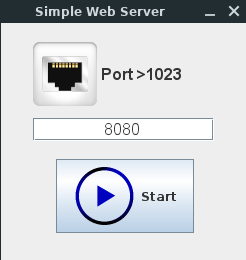

# Java Web Server

## A simple multi-threaded HTTP 1.0 Server implemented in Java for educational 
## purposes based on W3C specifications (http://www.w3.org/Protocols/):

* [W3](https://www.w3.org/Protocols/HTTP/AsImplemented.html) Hypertext Transfer Protocol -- HTTP/0.9
* [RFC 1945](http://www.ietf.org/rfc/rfc1945.txt) Hypertext Transfer Protocol -- HTTP/1.0
* [RFC 2616](http://www.ietf.org/rfc/rfc2616.txt) Hypertext Transfer Protocol -- HTTP/1.1
* [RFC 2617](http://www.ietf.org/rfc/rfc2617.txt) HTTP Authentication: Basic and Digest Access Authentication
* [RFC 6265](http://tools.ietf.org/html/rfc6265) HTTP State Management Mechanism (Cookies)

## For a more reliable solution, please check Jigsaw, W3C Java HTTP 1.1 server
## implementation (http://www.w3.org/Jigsaw/) or other existing open source Java  
## web servers (http://java-source.net/open-source/web-servers).

## This software is released under FreeBSD license.

## [Author info and contact](http://dasanjos.com) 

---
# RUNNING
---

## The Java Web Server runs on any Operational System with Java (JRE) 1.6+ installed 

## To start the Java Web Server, download the application jar file and run the following command:

~~~bash
    $ java -jar SimpleWebServer.jar
~~~ 

## To stop the Simple Web server, just press Ctrl+C on the command line.
